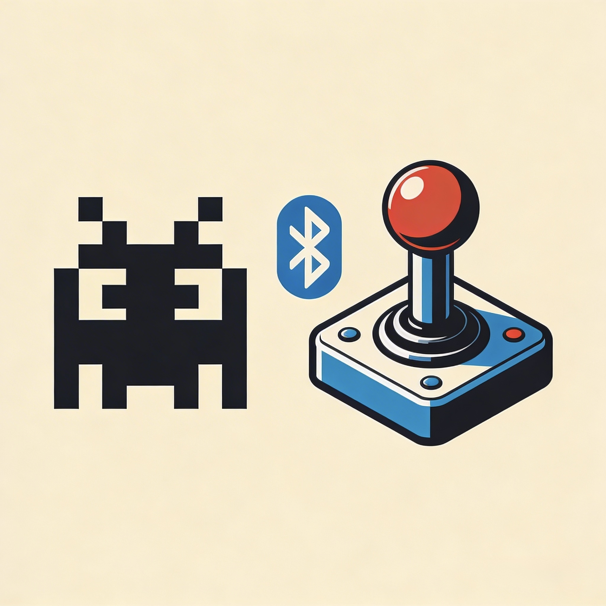
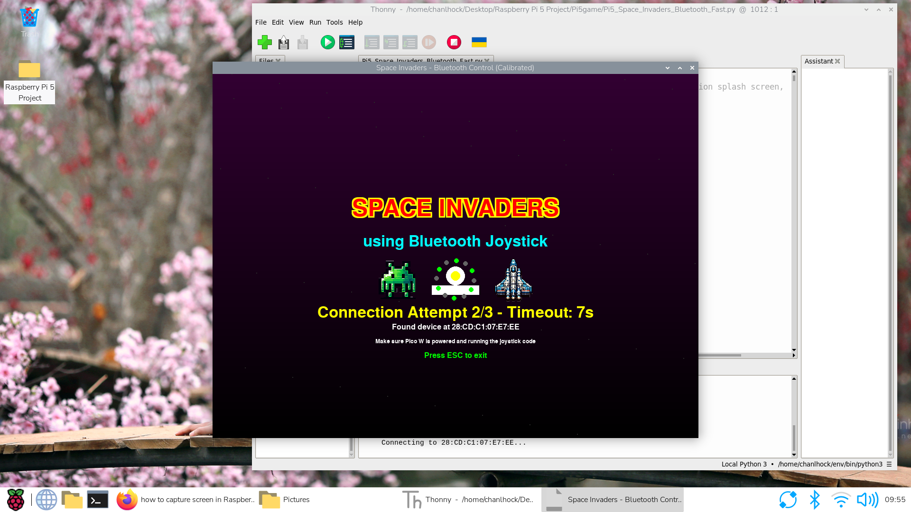
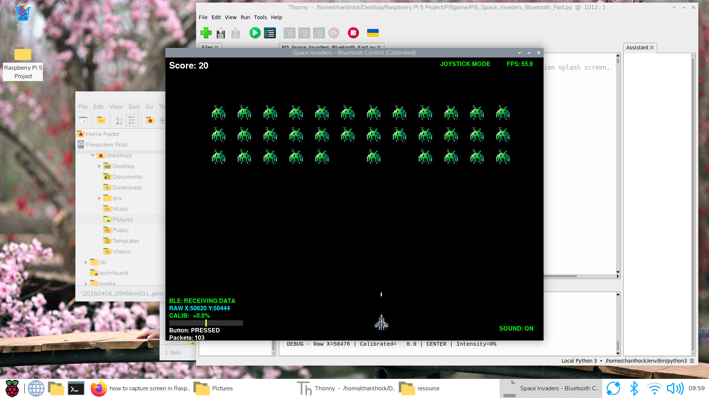
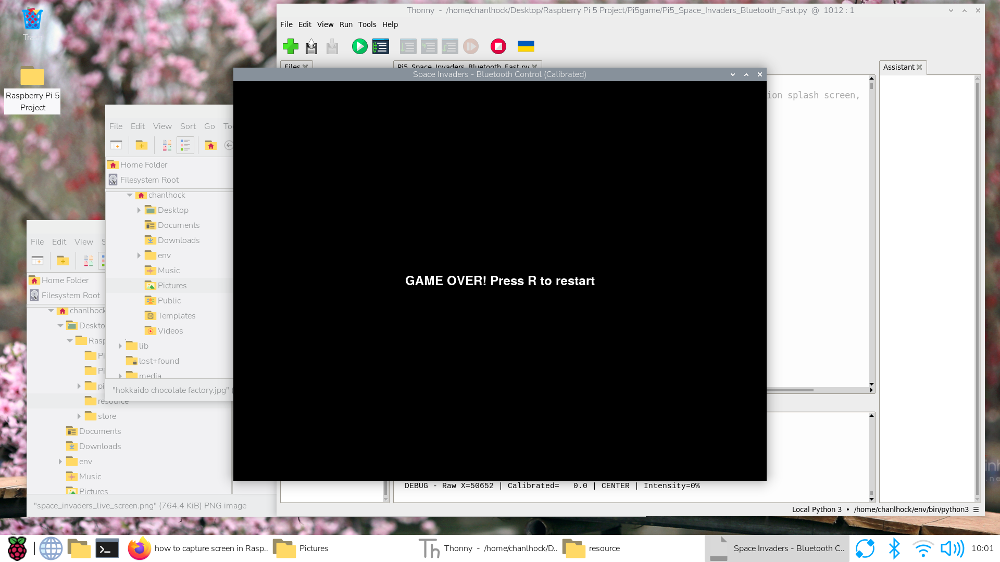

# :mouse: Welcome to Space Invaders with Pi Pico W Bluetooth Joystick 

<p float="left">
 
</p>

## Table of Contents
- [Description](#scroll-description)
- [Development Platform](#computer-development-platform)
- [Software Development](#floppy_disk-software-development)
- [Platform Tested](#iphone-platform-tested)
- [Screenshots](#film_strip-screenshots)
- [Buy Me a Coffee](#coffee-buy-me-a-coffee)
- [License](#page_with_curl-license)
- [Feedback and Suggestions](#speech_balloon-feedback-and-suggestions)

## :scroll: Description
Space Invaders Python code generated by DeepSeek AI that interfaces with a Raspberry Pi Pico W joystick through Bluetooth. The program runs on Raspberry Pi Pico W (Bluetooth Joystick) and Raspberry Pi 5 (Space Invaders).

## :computer: Development Platform
Program code is generated for Thonny using MicroPython. I have tested on Raspberry Pi Pico W and Raspberry Pi 5 running Thonny.

At the Raspberry Pi Pico W:
1. Do ensure that the Raspberry Pi Pico W is flashed with the correct *.uf2 file
2. The RPI_PICO_W-20251209-v1.27.0.uf2 file can be downloaded from DeepSeek folder in this repository.
3. Open Thonny and upload all the files in the repository folder DeepSeek/Pi Pico W Joystick onto Raspberry Pi Pico W. Program is using MicroPython.
4. Open the file Pico_W_Joystick_Bluetooth.py
5. Run Pico_W_Joystick_Bluetooth.py. The following output will be displayed in the Thonny run window.
Note: You can rename Pico_W_Joystick_Bluetooth.py to main.py so that the program will automatically run when Raspberry Pi Pico W power up.
~~~~
MPY: soft reboot
Initializing BLE...
Registering services...
Service registered, handle: 9
Advertising as 'Joystick_Pico'

========================================
PICO W READY - Move the joystick!
========================================
Press Ctrl+C to stop

Local: X=50444 ( 76%), Y=50428 ( 76%), Button=Released
Local: X=50476 ( 77%), Y=50636 ( 77%), Button=Released
Local: X=50620 ( 77%), Y=50844 ( 77%), Button=Released
Local: X=  304 (  0%), Y=60590 ( 92%), Button=Released
Local: X=50364 ( 76%), Y=50524 ( 77%), Button=Released
Local: X=65535 (100%), Y=65535 (100%), Button=Released
Local: X=65535 (100%), Y=65535 (100%), Button=Released
Local: X=50508 ( 77%), Y=23861 ( 36%), Button=Released
Local: X=57838 ( 88%), Y=50492 ( 77%), Button=Released
Local: X=65535 (100%), Y=65535 (100%), Button=Released
Local: X=65535 (100%), Y=64671 ( 98%), Button=Released
Local: X=50364 ( 76%), Y=50524 ( 77%), Button=Released
Local: X=50476 ( 77%), Y=50476 ( 77%), Button=Released
Local: X=50508 ( 77%), Y=50460 ( 76%), Button=Released
Local: X=50268 ( 76%), Y=50572 ( 77%), Button=Released
Local: X=50380 ( 76%), Y=50540 ( 77%), Button=Released
Local: X=50284 ( 76%), Y=50524 ( 77%), Button=Released

~~~~
6. Raspberry Pi Pico W is now ready and transmitting the Joystick movement data to Raspberry Pi 5. 

At the Raspberry Pi 5:
1. Open Thonny and upload all the files in the repository folder DeepSeek/Pi5game onto Raspberry Pi 5. Program is using MicroPython.
2. Open the file Pi5_Space_Invaders_Bluetooth_Fast.py
3. Run Pi5_Space_Invaders_Bluetooth_Fast.py

## :floppy_disk: Software Development:
Both programs are generated by DeepSeek AI in MicroPython using the following prompt:
~~~~
I have two systems, one in Raspberry Pi 5 and the other in Raspberry Pi Pico W. 

On Raspberry Pi 5 I would like the Micropython code to run on Thonny. The Raspberry Pi 5 with run Micropython code that :
- communicates with Raspberry Pi Pico W through Bluetooth. 
- Add a splash screen when the game starts that displays the title "Space Invaders using Bluetooth Joystick" in the middle of the screen in large characters (red character with yellow border) and play the space invader sound.
-The Bluetooth connection to Pi Pico should be complete before exiting the splash screen.
- run a space invaders game in a 800x600 dialog window. Can use pygame library to create the game.
- Takes in the joystick data that is transmitted through Bluetooth from Raspberry Pi Pico W connected to a joystick.
- User can use the joystick data and map to 800x600 dialog window and control the space invaders game.
- Joystick Button pressed at Raspberry Pi Pico W means release missile to shoot invaders
- Use  the invader sprite with a sprite in the file "spacesprite.png" in the game folder.
- Use the player sprite with a sprite in the file "ship.png" in the game folder. 
- Play from "music.mp3" file in the game folder when the splash screen starts.
- After attempting 3 times cannot connect to Pi Pico W then will allow user to use keyboard to play the game. Make sure that both joystick mode and keyboard mode, the left and right movement of the player is smooth.

On Raspberry Pi Pico W, there would be Micropython code that:
- pin assigned below:
- GP0 -> SDA (SSD1306 OLED)
- GP1 -> SCL (SSD1306 OLED)
- GP27 -> xAxis (joystick)
- GP26 -> yAxis (joystick)
- GP13 -> button (joystick)
- communicate with Raspberry Pi 5 through Bluetooth.
- Read the joystick data and transfer data to Raspberry Pi 5.
- OLED SSD1306 4 lines displays: first line (button pressed status), second line joystick x and third line joystick y axis
- Sound effect every time the missile hits the invaders.

Generate Micropython code solution for both Raspberry Pi 5 and Raspberry Pi Pico W. Please add appropriate comments in the generated code for readability and ease of understanding.
~~~~
Sprite image and sound file obtained from this webside:
(https://joecode22.itch.io/space-invaders)
    
## :iphone: Platform tested:
I have tested my code on:
- Raspberry Pi Pico W together with Raspberry Pi 5

https://github.com/user-attachments/assets/d868a1be-3dd3-4ba3-a6fc-a5a218ba0cf3

## :film_strip: Screenshots
<p float="left">
  
</p>
<p float="left">
   
</p>
<p float="left">
   
</p>

## :coffee: Buy Me a Coffee
If you appreciate my work, do support me by...<br>
<a href="https://www.buymeacoffee.com/chanlhock" target="_blank"></a>

## :page_with_curl: License
```
This program is licensed under the GNU General Public License v3.0 
Permissions of this strong copyleft license are conditioned on making  
available complete source code of licensed works and modifications,  
which include larger works using a licensed work, under the same  
license. Copyright and license notices must be preserved. Contributors  
provide an express grant of patent rights.
```
See the [GNU General Public License](LICENSE) for more details.

## :speech_balloon: Feedback and Suggestions
For any feedback or suggestions, feel free to contact me via email:\
:email: chanlhock@gmail.com :mouse:
